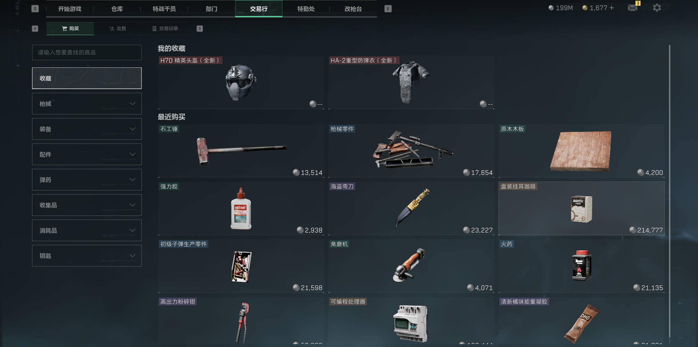

# 项目说明

基于屏幕像素/OCR 的自动化脚本，通过高频刷新交易行界面监控装备价格，截取低价装备购买。包含窗口管理、热键暂停、定时执行、状态监测(六位价格/无货/七位价格分隔符)、自动刷新与数据统计。

## 功能概要
1. 定时启动并运行指定时长。
2. 高频点击刷新交易行物品。
3. 并发监测三类事件：六位价格、无物品、七位价格分隔符。
4. 命中价格区间后暂停连点并执行购买流程。
5. 周期性执行“模式切换”刷新以防界面卡死。
6. 统计初末货币差额并记录日志。
7. 热键 `Ctrl+P` 实时暂停/恢复。
8. 日志存档。

## 运行环境
1. 操作系统：Windows (需要窗口句柄与 Win32 API)。
2. Python：建议 3.10+。
3. 需要安装本地 Tesseract OCR+中文语言包，并将其加入 PATH 或在系统可检索位置。
4. 屏幕分辨率设成1920x1080，游戏设成无边框窗口。

## 依赖安装
```bash
pip install -r requirements.txt
```

[Tesseract OCR 及中文语言包 chi_sim.traineddata 安装教程](https://zhuanlan.zhihu.com/p/692723574)

## 运行与使用
1. 打开三角洲并切换到交易行，收藏好六头或六甲。

2. 配置好`config.ini`。
3. 双击`点击脚本.bat`以管理员运行脚本。
4. 将游戏窗口置于屏幕最前面，或者脚本开始运行后会自动将游戏窗口置顶。
5. 程序会等待到 `execution_time` 后开始运行，期间输出与日志同时写入 `logs/` 目录。
6. 脚本将在运行`duration`时长后自动结束，或者手动暂停脚本并关闭。
7. 脚本强依赖固定坐标，误点可能造成意外操作。

## 日志与截图
1. 日志：`logs/log_时间戳.txt`。
2. 截图：`screenshots/` 下保存命中价格(若在代码中启用 `take_screenshot`)。

## 热键
`Ctrl+P`：暂停/恢复脚本（暂停时停止连点并解除置顶，恢复后重新置顶）。

## 目录结构示例
```
deltaforce_equipment/
  main.py
  config.ini
  detect_money.py
  detect_location.py
  mouse_keyboard_controller.py
  logs/
  screenshots/
```

## 配置文件 `config.ini` 示例
```ini
[window]
# 此三项不建议改动
# 游戏窗口名称
game_window_name = 三角洲行动
# 游戏窗口最小尺寸，用于区分启动器
min_width = 1920
min_height = 1080

[schedule]
# 此处设置开始执行时间
execution_time = 00:00
# 此处设置执行时长，单位秒
duration = 27000
# 此处设置执行多久切换模式进行刷新，单位秒
execution_time_single = 120

[limit]
# 此处设置预期价格上下限，上下限必须设置为六位数，脚本仅对价格的百万位进行识别和比较
# 下限
expected_price_1 = 100000
# 上限
expected_price_2 = 500000

[click_location]
# 此处设置物品点击位置 收藏一号位(660,240) 二号位(1100,240) 三号位(1600,240) 四号位(660,400) 五号位(1100,400) 六号位(1600,400)等屏幕坐标
x = 660
y = 240
```

字段说明：
1. `game_window_name`：用于匹配窗口标题(模糊包含)。
2. `min_width` / `min_height`：过滤掉启动器等非主要窗口。
3. `expected_price_1` / `expected_price_2`：有效购买价格区间(闭区间)。
4. `x` / `y`：高频点击位置(收藏槽位)。
5. `execution_time`：每日启动时间(24h)。
6. `execution_time_single`：两次“刷新操作”间隔秒数。
7. `duration`：本次运行总时长(秒)。

## 核心组件
1. `PurchaseStateMonitor`：多线程轮询三种状态，命中后进入失效态，待全部清空再重武装，防抖动。
2. `Tee`：双写标准输出到控制台与日志文件，并捕获未处理异常。
3. 连点线程：受 `thread_pause_click` 控制，购买/刷新/暂停时自动停顿。

## 工作流程简述
1. 启动 -> 置顶窗口 -> OCR 初始货币 -> 启动连点与监视线程。
2. 轮询事件队列：  
   - 六位价格且落在区间：暂停连点 -> 尝试购买 -> 返回上级界面。  
   - 无货 / 七位分隔符：返回上级界面。  
3. 到达 `execution_time_single`：执行刷新流程(模式切换进行刷新，防止卡顿)。
4. 运行满 `duration`：统计最终货币并输出消耗。

## 已知问题
脚本连续运行超过约7小时后（本人电脑测试结果），游戏可能会出现闪退，目前没有解决方案。

## 免责声明

脚本仅供学习和研究目的使用，作者不对因使用该脚本而导致的任何后果负责。使用该脚本的风险完全由用户自行承担。

用户须知：

尽管脚本设计为非侵入性，但使用第三方工具可能违反目标平台的使用条款或服务协议。 使用该脚本可能导致账号被封禁或其他形式的处罚。

作者不保证脚本的稳定性、安全性或合法性。

## 感谢
感谢ChatGPT在脚本编写中提供的帮助。
